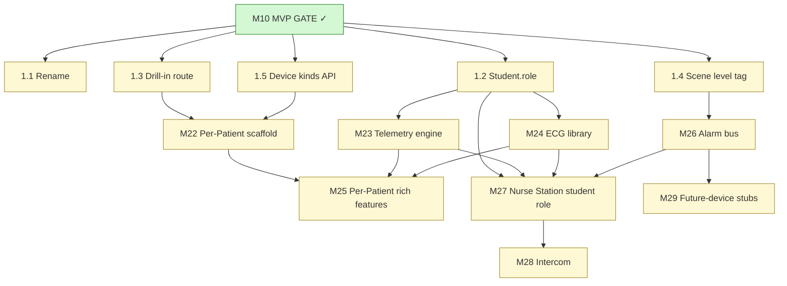

# Phase 7 plan — Nursing Station (supervisor role) + Patient Character Management + Telemetry/ECG/Intercom

**Status:** PLAN — not yet started.
**Authored:** 2026-05-26 (post-MVP gate clarification).
**Methodology:** Mirrors the v6 Development Plan's M-style modules.
Each section below is a self-contained module specification with
Purpose, Files Touched, New Files, Acceptance, Blocks/Blocked-by,
and Effort Estimate.

---

## 0. Why this phase exists — terminology clarification

The MVP build conflated two roles under one name:

1. **Instructor's operator surface.** The browser the instructor
   sits at to set up encounters, freeze the room, inject scenes,
   manage simulated patients. This is the **Control Room**.
2. **In-simulation supervisory role** played by a student. A charge
   nurse / floor supervisor who monitors a roomful of patients
   remotely — telemetry strips, device status, alarm board,
   intercom to any bed. This is the **Nursing Station**.

In v7 M5, the instructor surface at `/portal/room` was labeled
"Charge-nurse dashboard." That name belongs to the in-sim student
role, not the instructor. Phase 7 corrects the name, **extracts
patient-character-management features into a dedicated instructor
sub-screen**, and **adds the Nursing Station as a new student role**
with the telemetry / device / alarm / intercom features that role
requires in a real clinical workflow.

### Conceptual model after Phase 7

```
INSTRUCTOR (Operator) — /portal/room and children
├── Multi-Patient Control (renamed from "Charge-nurse dashboard")
│   ├── Overview grid       (existing M5 — kept)
│   ├── Wizard               (existing M6 — kept)
│   └── Per-Patient Console  (NEW — M22 extraction)
│       ├── Live telemetry preview (M23)
│       ├── ECG waveform picker     (M24)
│       ├── Device list + state     (uses v6 device subsystem)
│       ├── Quick alarm inject       (writes through M26 alarm bus)
│       └── Telemetry overrides      (instructor force-set values)

STUDENT (in-simulation roles)
├── Bedside (existing — one student per chat station)
│   ├── Chat station        (v3)
│   ├── EHR station          (v5)
│   └── Device station       (v6 — pumps/cabinets)
│       + future: call bell, bed alarm, code blue button (M29)
└── NEW — Nursing Station role
    ├── Multi-patient telemetry view  (M27 page)
    ├── Device status per patient      (read-only)
    ├── Alarm board                    (M26 alarm bus)
    └── Intercom                       (M28 — voice to any bed)
```

---

## 1. Existing modules to modify

Five small touch-ups to land before the new modules. Each is
< 0.5 day; all stay v6-compatible.

### 1.1 Rename "Charge-nurse dashboard" → "Multi-Patient Control"

The label on the instructor surface, in nav, code comments, and
docs. Code paths stay at `/portal/room`. Variable names in
`control_room.html`/`.js`/`.css` keep `room-*` prefixes — only the
human-readable label changes.

**Files touched:**
- `portal/templates/control_room.html` (title block, `<h1>`)
- `portal/templates/base.html` (nav label: `Room (multi)` → `Multi-Patient Control` or `Patient Management`)
- `portal/static/control_room.{js,css}` (header comments only)
- `portal/server.py` (docstring comments)
- `docs/module_guides/M04_*`, `M05_*`, `M06_*`, `M09_*` (text only)
- `BUILD_STATE.md` (text only)

**Acceptance:** existing 58 v7 tests still pass; preview shows the
new title in the page header and nav.

**Effort:** 0.25 day.

### 1.2 Add a "role" field to the Student row

Students playing the Nursing Station role need to be distinguishable
from bedside students at the data layer so M27's join flow can
route them correctly.

**Files touched:**
- `portal/ehr_db.py` — schema migration v5 (append-only):
  ```sql
  ALTER TABLE student ADD COLUMN role TEXT NOT NULL DEFAULT 'bedside';
  ```
- `portal/control_room.py` — `Student` dataclass adds `role: str = "bedside"`
- `portal/ehr_db.py` — CRUD helpers updated to round-trip the new column

**Acceptance:** migration v5 idempotent + preserves v4 data; existing
rosters default to `bedside`; new `register_student(..., role=...)`
persists.

**Effort:** 0.5 day.

### 1.3 Extend the M5 dashboard with a per-encounter drill-in slot

Currently clicking a card on `/portal/room` navigates to
`/portal/control/ops?join=<code>` (the v6 single-encounter ops view).
M22 introduces the new Per-Patient Console at
`/portal/room/encounter/<id>`; M1.3 only adds the routing target
(the page itself is M22). For backwards compat, the legacy ops link
remains available as a secondary option.

**Files touched:**
- `portal/static/control_room.js` — primary card click navigates to
  `/portal/room/encounter/<id>`; a "Legacy ops view" link on the
  card stays as a secondary entry.

**Acceptance:** click test in preview confirms the new URL; legacy
ops link still works.

**Effort:** 0.25 day.

### 1.4 Extend the scenes engine to flag alarms

`scenes.code.blue` already writes a `note.save` "CODE BLUE"
announcement + `instructor.trigger` marker + (if pump bound) device
alarm. M26's alarm bus needs to find these. Add a `level: "alarm"`
tag in the `_scene_payload` of any alarm-class scene.

**Files touched:**
- `portal/scenes.py` — payload tag, no behavior change.

**Acceptance:** existing M7 tests pass unchanged; new tag is in the
payload for `code.blue`.

**Effort:** 0.1 day.

### 1.5 Extend the device subsystem to enumerate device kinds

The Per-Patient Console (M25) lists devices currently bound to an
encounter. The device subsystem already supports `pump_iv`,
`pump_enteral`, and `cabinet`. M29 will add 4 more kinds; M22 needs
the existing list exposed via a stable API.

**Files touched:**
- `portal/devices/registry.py` — add a `list_kinds()` helper.

**Acceptance:** a unit test confirms the helper returns the known
device kinds.

**Effort:** 0.1 day.

**Pre-Phase 7 total:** ~1.5 days.

---

## 2. New modules

Eight modules, ~17 engineer-days, mirrors the v6 plan's M-shape.

### MODULE M22 — Per-Patient Console scaffold (instructor)

**Goal:** Extract the "manage one simulated patient's state" surface
from the M5 overview into a dedicated instructor sub-page at
`/portal/room/encounter/<encounter_id>`. M22 ships the scaffold —
the rich features (telemetry preview, ECG picker, alarm inject) land
in M23 / M24 / M25.

- **New files:**
  - `portal/templates/encounter_console.html`
  - `portal/static/encounter_console.{js,css}`
- **Files touched:**
  - `portal/server.py` — new `GET /portal/room/encounter/{encounter_id}`
    route returning the scaffold.
- **Acceptance:**
  - Route renders 200 with the right encounter id.
  - "Back to overview" link returns to `/portal/room`.
  - Browser preview smoke test on a 2-bed quickstart room.
- **Blocks:** M23, M24, M25.
- **Blocked by:** M1.3 (drill-in target).
- **Est. effort:** 1.5 days.

### MODULE M23 — Telemetry simulation engine (`portal/telemetry.py`)

**Goal:** Derive a continuous telemetry snapshot per encounter from
its latest `vitals.record` chart event, with optional instructor
overrides. No physiological model — just smoothed sampling around
the last set vitals (small jitter ±2 BPM HR, ±1 mmHg BP, etc.) so
the displayed numbers look live rather than static.

- **New files:**
  - `portal/telemetry.py` — `snapshot(encounter_id) -> dict`,
    `override(encounter_id, key, value)`.
- **Files touched:**
  - `portal/ehr_db.py` — schema migration v5 adds
    `ehr_session.telemetry_overrides_json TEXT NULL`.
- **New routes (in `server.py`):**
  - `GET /api/encounter/{id}/telemetry` — poll snapshot.
  - `POST /api/encounter/{id}/telemetry/override` — instructor force-set.
- **Acceptance:**
  - `tests/v7/test_telemetry_snapshot_uses_latest_vitals.py`
  - `tests/v7/test_telemetry_scene_injection_changes_snapshot.py`
  - `tests/v7/test_telemetry_overrides_take_precedence.py`
- **Blocks:** M25, M27.
- **Blocked by:** M1.2 (schema v5 housekeeping).
- **Est. effort:** 2 days.

### MODULE M24 — ECG waveform library (`portal/ecg.py`)

**Goal:** A static catalog of named ECG waveforms keyed by rhythm
class. Each entry is a parameterized waveform generator that the
client renders as an SVG path. Initial catalog:

| Waveform id | Class | Common use |
|---|---|---|
| `nsr` | Normal | Baseline; default for a stable patient |
| `sinus_tachy` | Tachy | Septic / dehydrated / anxious patient |
| `sinus_brady` | Brady | Athlete; vagal; medication effect |
| `afib` | Irregular | AFib with controlled or RVR |
| `aflutter` | Regular | Atrial flutter with 2:1 / 4:1 |
| `vtach_mono` | Wide-complex tachy | Monomorphic VT |
| `vtach_poly` | Wide-complex tachy | Torsades de pointes |
| `vfib` | Chaotic | Ventricular fibrillation |
| `asystole` | Flatline | Cardiac arrest |
| `pea` | Organized w/o pulse | Pulseless electrical activity |
| `paced` | Paced rhythm | After pacemaker |

Each entry includes: rate range (default + scenario-tunable),
amplitude, characteristic intervals. The client renders the waveform
in a scrolling strip from these parameters; no recordings, no
external audio.

- **New files:**
  - `portal/ecg.py` — catalog + generator helpers (server-side; the
    actual SVG rendering happens client-side).
  - `portal/static/ecg_strip.js` — renderer (used by M25 and M27).
- **Files touched:**
  - `portal/ehr_db.py` — schema migration v5 adds
    `ehr_session.ecg_waveform_id TEXT NULL`.
  - `portal/server.py` — `GET /api/ecg/catalog`,
    `POST /api/encounter/{id}/ecg`.
- **Acceptance:**
  - `tests/v7/test_ecg_catalog_lists_eleven_built_in_waveforms.py`
  - `tests/v7/test_ecg_set_per_encounter_persists.py`
  - Manual browser: M25 picker renders all 11 strips, switching
    between them is visible.
- **Blocks:** M25, M27.
- **Blocked by:** M1.2.
- **Est. effort:** 2 days (mostly waveform math + renderer).

### MODULE M25 — Per-Patient Console rich features

**Goal:** Light up M22's scaffold with the actual instructor controls
for managing a simulated patient.

- **Files touched:**
  - `portal/templates/encounter_console.html` (sections added)
  - `portal/static/encounter_console.{js,css}` (sections added)
  - `portal/server.py` (helper functions; no new public routes
    beyond what M23/M24 already added).
- **UI sections:**
  1. **Live telemetry preview** — small strip showing HR/SBP/SpO2/RR/Temp
     using M23 snapshot, polled at 1 s.
  2. **ECG strip** — uses `ecg_strip.js` to render the encounter's
     current waveform. Selector dropdown drives `POST /api/encounter/{id}/ecg`.
  3. **Device list** — read-only list of devices bound to this
     encounter (uses M1.5's `list_kinds()`).
  4. **Telemetry override sliders** — force HR / SBP / DBP / SpO2 /
     RR / Temp. Each toggleable; OFF = derived from chart events.
  5. **Quick scene inject** — reuses M5's scene injector dialog,
     pre-targeted to this encounter.
- **Acceptance:**
  - Manual browser: open Per-Patient Console for a 2-bed room → all
    five sections render → ECG selector flips waveform → override
    slider changes the telemetry strip value.
  - `tests/v7/test_encounter_console_renders_all_sections.py` (smoke).
- **Blocks:** none directly; M27 mirrors its ECG strip use.
- **Blocked by:** M22, M23, M24.
- **Est. effort:** 2.5 days.

### MODULE M26 — Alarm bus (`portal/alarms.py`)

**Goal:** A unified read of all active alarms across a room. Reads
from three sources:

1. **Device events** — `alarm.injected` rows from `device_event`
   (existing v6 path); cleared by `alarm.cleared`.
2. **Scene events** — `instructor.trigger` rows whose payload
   carries `level: "alarm"` (M1.4 tag). Examples: code.blue
   compound marker, future fire-alarm scene.
3. **Future device stubs** — call bell, bed alarm, code blue button,
   fire alarm (added in M29).

Returns a per-room list ordered by severity then ts, with: alarm
id, source ('device' / 'scene' / 'bedside_button'), kind, encounter
id, ts, severity ('info' / 'warning' / 'critical'), cleared_at,
target_label.

- **New files:**
  - `portal/alarms.py` — `active_alarms(room_id) -> list[dict]`,
    `clear_alarm(alarm_id) -> dict`.
- **Files touched:**
  - `portal/server.py` — `GET /api/room/alarms`, `POST /api/alarm/{id}/clear`.
- **Acceptance:**
  - `tests/v7/test_alarms_from_pump_appear_in_room_alarms.py`
  - `tests/v7/test_alarms_from_code_blue_scene_appear.py`
  - `tests/v7/test_clear_alarm_removes_it_from_active_list.py`
- **Blocks:** M27 (the nurse-station page polls this).
- **Blocked by:** M1.4.
- **Est. effort:** 2 days.

### MODULE M27 — Nursing Station student role (`/portal/students/nurse_station`)

**Goal:** The in-sim supervisor surface. A student picks "Nursing
Station" from the join page's role selector and lands on a
multi-patient overview showing telemetry strips + device status +
the live alarm board across every encounter in the room.

- **New files:**
  - `portal/templates/nurse_station.html` — public (no operator vault).
  - `portal/static/nurse_station.{js,css}`.
- **Files touched:**
  - `portal/templates/student_join.html` — adds a role picker
    ("Bedside" / "Nursing Station") on Step 2.
  - `portal/static/student_join.js` — branches the POST: bedside
    → `/portal/students/register` (M9 existing), nurse_station →
    `/portal/students/register_nurse` (new).
  - `portal/server.py` — new `POST /portal/students/register_nurse`
    (creates Student with role='nurse_station', no encounter
    assignment) and `GET /portal/students/nurse_station?sid=...`
    page render.
- **Per-bed card on the nurse-station page contains:**
  - Bed label + patient persona name + state badge.
  - Mini ECG strip (`ecg_strip.js`).
  - Telemetry strip (HR / BP / SpO2 / RR / Temp) — uses M23.
  - Device pill row (color-coded by state — running / alarming / off).
  - Tap-to-open intercom (M28) — placeholder button until M28 lands.
- **Acceptance:**
  - `tests/v7/test_nurse_station_role_register_creates_role_row.py`
  - `tests/v7/test_nurse_station_page_renders_all_encounters.py`
  - Manual browser: join flow lets a student pick the nurse role →
    lands on `/portal/students/nurse_station?sid=...` → sees the 2
    beds with telemetry + ECG strips updating.
- **Blocks:** M28 (intercom is invoked from this page).
- **Blocked by:** M1.2 (Student.role), M23, M24, M26.
- **Est. effort:** 3 days.

### MODULE M28 — Intercom (bi-directional voice)

**Goal:** Let the Nursing Station student talk to a specific bed
and hear / read the response. The MVP cut uses the simpler path
(no WebRTC): nurse-station sends a short text prompt → server
synthesizes it through ElevenLabs with the encounter's *staff*
voice (or a generic "Hospital Communications" voice if no staff
persona is bound) → bedside chat station auto-plays it as if it
were a character turn. Bedside replies via chat as normal.

A v7.1 candidate is full WebRTC audio (true mic-to-mic). Out of
scope here; the data path remains the same (a `comm.intercom`
chart event captures the exchange for the debrief).

- **New files:**
  - `portal/intercom.py` — server-side handler for the synthesis +
    chart-event recording.
  - `portal/static/intercom.js` — nurse-station-side widget.
- **Files touched:**
  - `portal/templates/nurse_station.html` — intercom dialog.
  - `portal/server.py` — `POST /api/intercom/{encounter_id}/page`.
  - `portal/static/station.js` — bedside auto-plays intercom audio.
- **Acceptance:**
  - `tests/v7/test_intercom_page_records_comm_event.py`
  - `tests/v7/test_intercom_uses_staff_persona_voice_when_available.py`
  - Manual browser: nurse station sends "Patient in Bed 2 reports
    pain 8/10, need orders" → audio plays on Bed 2 station; chat
    log shows the turn.
- **Blocks:** none.
- **Blocked by:** M27.
- **Est. effort:** 3 days (down from a full WebRTC's 5+ — the
  v7.1 WebRTC upgrade is tracked as a separate candidate).

### MODULE M29 — Future-device stubs (call bell, bed alarm, code blue button, fire alarm)

**Goal:** Add four new device kinds to the v6 device subsystem so
students can press a button that surfaces as an alarm on the M26
bus. Each device is a single-button HTML page that the student
joins via QR (matching the pump / cabinet device-station pattern).

- **New files (per device kind, ~50 lines each):**
  - `portal/devices/call_bell/spec.json`, `engine.py`, `skin.svg`
  - `portal/devices/bed_alarm/spec.json`, `engine.py`, `skin.svg`
  - `portal/devices/code_blue_button/spec.json`, `engine.py`, `skin.svg`
  - `portal/devices/fire_alarm/spec.json`, `engine.py`, `skin.svg`
- **Files touched:**
  - `portal/devices/registry.py` — register the new kinds.
- **Acceptance:**
  - Each device joins a room (existing v6 device-routes coverage).
  - Pressing the button emits a `device_event` of type
    `alarm.injected` with `kind: <device_kind>`.
  - The M26 alarm bus surfaces the alarm at the nurse-station page.
  - `tests/v7/test_call_bell_press_appears_on_nurse_station.py`
  - `tests/v7/test_fire_alarm_press_appears_critical.py`
- **Blocks:** none.
- **Blocked by:** M26.
- **Est. effort:** 2 days.

---

## 3. Effort summary

| Section | Modules | Days |
|---|---|---:|
| 1. Existing-module touch-ups | 1.1–1.5 | 1.5 |
| 2.1 Per-Patient Console scaffold | M22 | 1.5 |
| 2.2 Telemetry simulation | M23 | 2.0 |
| 2.3 ECG waveform library | M24 | 2.0 |
| 2.4 Per-Patient Console rich features | M25 | 2.5 |
| 2.5 Alarm bus | M26 | 2.0 |
| 2.6 Nursing Station student role | M27 | 3.0 |
| 2.7 Intercom (no-WebRTC v1) | M28 | 3.0 |
| 2.8 Future-device stubs | M29 | 2.0 |
| **Total** | **+8 modules** | **19.5** |

**19.5 engineer-days ≈ 4 calendar weeks for one engineer**, **2.5
weeks for two engineers running independent phases** (M22+M23+M24
can run in parallel after the 1.x touch-ups; M26+M27 once those
land; M28+M29 close out).

The total v7 build (Phase 0–6 MVP at 41 days + Phase 7 at 19.5 days
+ Phases 8–15 at the remaining 20.5 days) is **~81 engineer-days**.
Still inside the 16-week calendar window from the original P6 plan
with comfortable buffer.

---

## 4. Dependency graph (post-MVP, Phase 7)



---

## 5. Where this slots into the existing 22-module plan

The MVP plan (M0–M10) is complete. The remaining v6 plan modules
(M11–M21) still apply — they're the "Full Build" features
(Activities, dual chart mode, cohort debrief, WebSocket, cost caps,
observer, capacity, Playwright, LAN release gate).

Phase 7 (M22–M29) is **additive** to that plan. Three slotting
options:

1. **After M21 (release gate)** — Phase 7 begins after the formal
   LAN release of the v6-plan scope. Operator demos the MVP +
   full-build features, then Phase 7 lands as v7.1.
2. **Before M21, after M15 (cohort debrief)** — slot Phase 7 in
   before WebSocket / cost caps / observer / capacity / LAN release
   so the release gate covers Phase 7 too. Adds ~4 weeks before LAN
   release. Most ambitious.
3. **In parallel with M11–M19** — Phase 7 modules with no overlap
   on the v6-plan modules can run on a second engineer
   independently. M22/M23/M24/M26 touch new files entirely;
   M27/M28 share `student_join.html` (M9) and `station.js` (v3
   chat) so they'd serialize on those files.

**Recommendation:** **Option 1 (after M21).** Reasons:
- The MVP gate is freshly verified — Phase 7 builds on a stable
  base, not a moving target.
- Operator can demo + collect classroom feedback (the original M10
  pause-here intent) including feedback on whether the
  nursing-station role is required at the scale they actually
  deploy.
- Phase 7 introduces no v6-regression risk because nothing in
  Phase 7 modifies v6's contract; the M10 byte-for-byte test stays
  green.
- WebSocket transport (M16) lands before Phase 7 — the
  nursing-station telemetry strip would feel laggy on HTTP poll
  alone, and M16's per-room channel push is exactly the right
  vehicle.

---

## 6. Pause/resume contract

Phase 7 modules follow the same `BUILD_STATE.md` + per-module guide
contract as M0–M21:
- Each module gets its own `M<NN>_<slug>.md` in
  `docs/module_guides/` with Purpose / Files / Acceptance / Change
  list / Open questions.
- Rendered to PDF via `render_pdfs.py`.
- Phase-table row in `BUILD_STATE.md` flips to DONE only when
  acceptance tests are green AND the manual browser flow (where
  applicable) has been verified.
- `CONTINUATION.md`'s seven-step resume protocol works unchanged.

---

## 7. Out of scope (explicit)

These have been mentioned in the source clarification but are NOT
in Phase 7:

- **Real bi-directional WebRTC audio** between Nursing Station and
  bedside. M28 ships a one-way TTS-to-bedside path with text-back.
  WebRTC is a v7.1 candidate; the data contract (`comm.intercom`
  chart event) is forward-compatible.
- **Autonomous physiological model.** Telemetry (M23) interpolates
  around the latest `vitals.record`; it does not drive vitals
  forward in time on its own. The physiology engine is the v7.2
  candidate (referenced in P6 §10).
- **Telemetry alarms on out-of-range vitals.** M26 surfaces alarms
  from device events and scene events. A future module would let
  the instructor configure threshold alarms ("HR > 130 triggers
  tachy alarm") that automatically fire on M23's telemetry — that
  needs the threshold-editor UI plus the alarm-bus interface,
  ~1.5 days of work, deferred.
- **Voice-recognition return path** from bedside. M28 sends voice
  one-way (nurse → bed). A bedside student's microphone reply
  goes through the existing v6 student chat path as text.
- **Recording / archiving** of intercom audio. The `comm.intercom`
  event stores the TEXT and a reference to the synthesized voice
  ID; the audio itself is regenerated on demand (no PHI risk since
  every persona is synthetic).

---

## 8. Acceptance for the plan itself

This document is acceptable when:
- ✓ Naming clarification documented (instructor surface vs. in-sim role).
- ✓ Each new module has Purpose / Files / Acceptance / Effort.
- ✓ Dependency graph shows where M22+ slots into M0–M21.
- ✓ Effort summary fits the v6-plan's calendar budget (~16 weeks
  total).
- ✓ Pause/resume protocol carries forward unchanged.
- ✓ Out-of-scope items explicitly enumerated.

The next step is operator review. On approval, M22+ start at the
"recommend after M21" cadence above; in the interim the plan
document lives in `docs/module_guides/PHASE7_PLAN_*` and is
referenced from `BUILD_STATE.md`.
